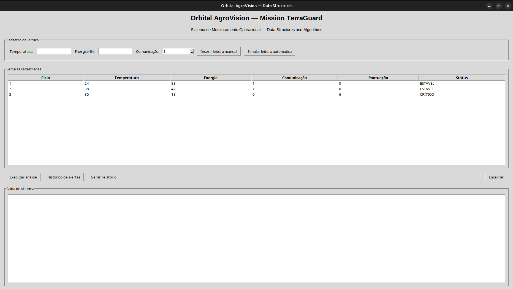

# Demonstração Prática — Data Structures and Algorithms

## Projeto

**Orbital AgroVision — Mission TerraGuard**

Este arquivo apresenta as evidências de execução do sistema de monitoramento desenvolvido para a disciplina de **Data Structures and Algorithms**.

A demonstração mostra o funcionamento da interface gráfica, cadastro de leituras, simulação automática, análise das leituras, histórico de alertas e relatório resumido.

---

## 1. Interface inicial

O sistema inicia exibindo uma interface gráfica com campos de entrada, botões de ação, tabela de leituras e área de saída do sistema.

---

## 2. Inserção manual de nova leitura

Nesta etapa, o usuário insere manualmente uma nova leitura da missão, informando temperatura, nível de energia e status da comunicação.

---

## 3. Simulação automática de leitura

Nesta etapa, o sistema gera automaticamente uma nova leitura simulada da missão.

---

## 4. Análise automática das leituras

O sistema percorre as leituras cadastradas e aplica as regras de verificação automática:

- Temperatura > 80 → alerta de superaquecimento;
- Energia < 20 → economia de energia;
- Comunicação = 0 → falha de comunicação.

---

## 5. Histórico de alertas

O sistema apresenta apenas os ciclos que registraram alertas reais, facilitando a identificação de situações críticas.

---

## 6. Relatório resumido

O sistema gera um resumo geral da missão, mostrando total de leituras, quantidade de estados estáveis, em atenção e críticos, além do ciclo mais crítico.

---

## Conclusão da demonstração

A demonstração comprova que o sistema executa corretamente as principais funcionalidades exigidas:

- Interface gráfica;
- Inserção manual de dados;
- Simulação automática de leituras;
- Visualização das leituras em tabela;
- Análise automática;
- Histórico de alertas;
- Relatório resumido;
- Uso de listas, dicionários, funções, condicionais e repetição.
