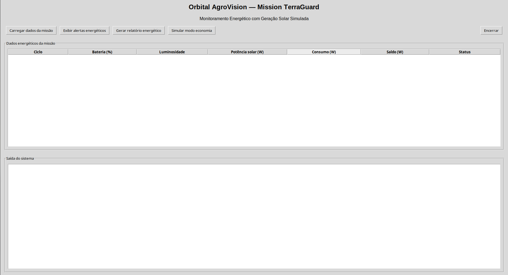
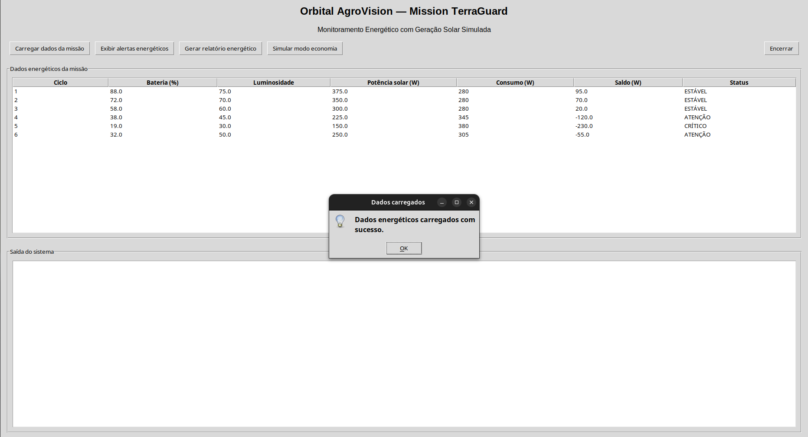
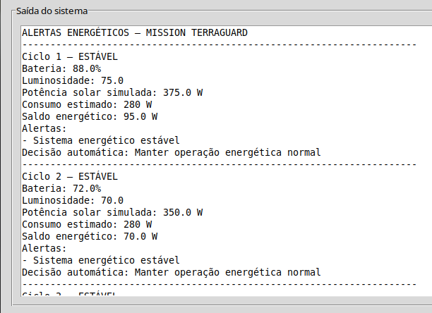
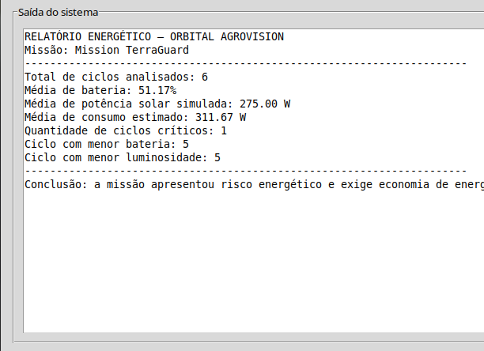
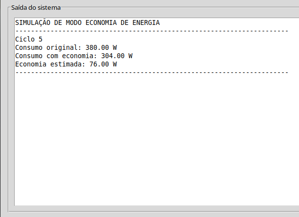

# Orbital AgroVision — Mission TerraGuard

## Soluções em Energias Renováveis e Sustentáveis

## Integrantes

* João Vitor Jun Nishiye De Sousa — RM: 572079
* Davi Sinhorini Pacheco — RM: 569487

---

## Objetivo

A **Orbital AgroVision** é uma solução inteligente de monitoramento espacial aplicada ao agronegócio sustentável.

Nesta disciplina, o foco está no **monitoramento energético** da missão **Mission TerraGuard**, analisando dados simulados relacionados a bateria, luminosidade, potência solar, consumo energético e risco operacional.

O objetivo é interpretar dados da missão e gerar alertas automáticos para apoiar decisões de economia de energia, uso eficiente de recursos e sustentabilidade.

---

## Como o sistema funciona

O sistema carrega dados simulados da missão e realiza uma análise energética de cada ciclo.

A partir dos dados de bateria, luminosidade, temperatura, comunicação e risco ambiental, o sistema calcula:

* Potência solar simulada;
* Consumo energético estimado;
* Saldo energético;
* Status energético do ciclo;
* Alertas automáticos;
* Decisão recomendada;
* Relatório energético final.

---

## Variáveis utilizadas

| Variável           | Função no sistema                                  |
| ------------------ | -------------------------------------------------- |
| `bateria`          | Representa a energia disponível no módulo          |
| `luminosidade`     | Representa o potencial de geração solar simulada   |
| `temperatura`      | Influencia o consumo energético do módulo          |
| `comunicacao`      | Indica qualidade da comunicação com a base         |
| `risco_ambiental`  | Indica risco na área agrícola monitorada           |
| `potencia_solar`   | Potência simulada gerada a partir da luminosidade  |
| `consumo_estimado` | Consumo calculado com base nas condições da missão |
| `saldo_energetico` | Diferença entre geração solar e consumo estimado   |

---

## Regras de análise energética

| Condição             | Interpretação              |
| -------------------- | -------------------------- |
| Bateria < 50         | Atenção energética         |
| Bateria < 20         | Bateria crítica            |
| Luminosidade < 40    | Baixa geração solar        |
| Saldo energético < 0 | Consumo maior que geração  |
| Risco ambiental > 70 | Priorizar funções críticas |

---

## Decisões automáticas

O sistema gera decisões básicas, como:

* Ativar economia de energia;
* Reduzir consumo;
* Priorizar comunicação com a base;
* Priorizar sensores ambientais;
* Manter operação energética normal.

---

## Arquivos da entrega

```text
energias_renovaveis/
├── README.md
├── analise_energia_potencia.md
├── entrega_energias.txt
├── monitoramento_energia.py
└── sustentabilidade.md
```

---

## Demonstração do sistema

### Interface inicial



### Dados carregados



### Alertas energéticos



### Relatório energético



### Simulação de modo economia



---

## Link do vídeo

insira link aqui

---

## Conclusão

O sistema demonstra como conceitos de energia, potência, geração solar simulada e sustentabilidade podem ser aplicados ao monitoramento de uma missão espacial experimental.

A solução contribui para a proposta da Orbital AgroVision ao mostrar como a análise energética pode apoiar decisões sustentáveis no agronegócio, reduzindo desperdícios e priorizando recursos críticos em cenários de risco.

