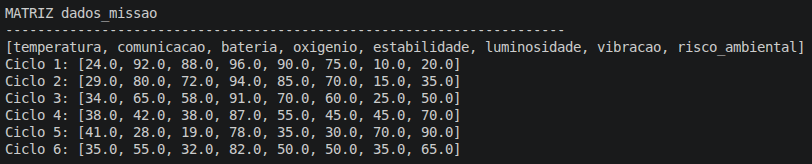
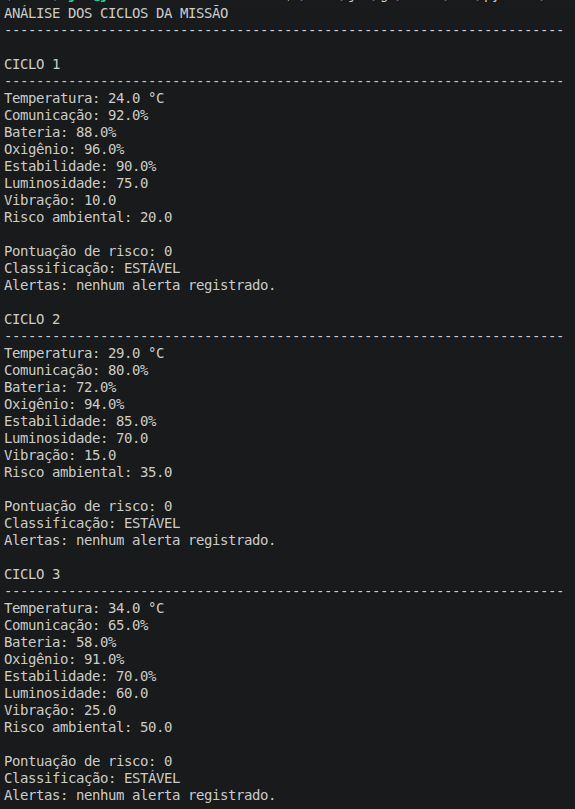
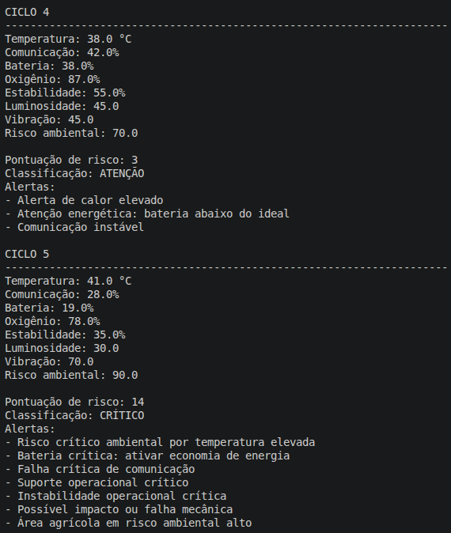
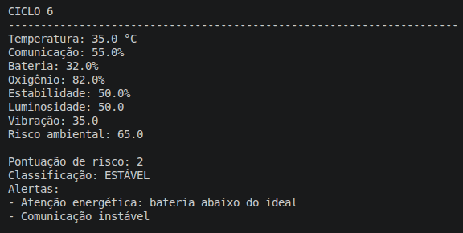
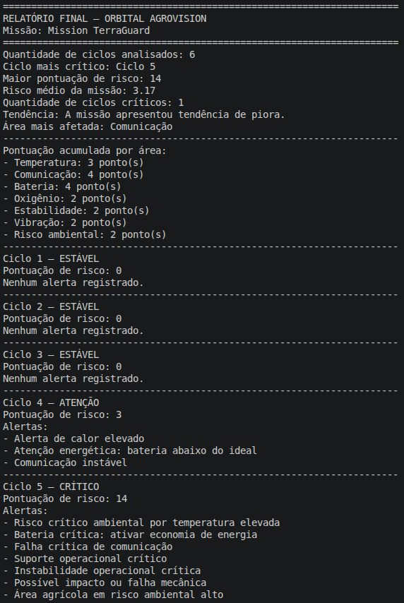
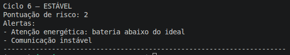

# Orbital AgroVision — Mission TerraGuard

## Pensamento Computacional e Automação com Python

## Integrantes

* João Vitor Jun Nishiye De Sousa — RM: 572079
* Davi Sinhorini Pacheco - RM 569487

## Objetivo

A **Orbital AgroVision** é um sistema inteligente de monitoramento espacial aplicado ao agronegócio sustentável.

O objetivo do sistema é simular uma missão de observação agrícola chamada **Mission TerraGuard**, analisando dados operacionais e ambientais para identificar riscos, gerar alertas automáticos e apoiar decisões sustentáveis.

## Como o sistema funciona

O sistema utiliza dados simulados de uma missão espacial experimental aplicada ao monitoramento agrícola.

Esses dados representam ciclos da missão. Cada ciclo contém informações como temperatura, comunicação, bateria, oxigênio, estabilidade, luminosidade, vibração e risco ambiental.

O programa:

1. Carrega os dados da missão;
2. Organiza os dados em uma matriz chamada `dados_missao`;
3. Analisa cada ciclo da missão;
4. Gera alertas automáticos;
5. Calcula a pontuação de risco de cada ciclo;
6. Classifica os ciclos como estável, atenção ou crítico;
7. Identifica a tendência da missão;
8. Identifica a área mais afetada;
9. Exibe um relatório final no terminal.

## Variáveis monitoradas

| Variável          | Descrição                                          |
| ----------------- | -------------------------------------------------- |
| `temperatura`     | Temperatura detectada na área ou módulo monitorado |
| `comunicacao`     | Qualidade do sinal com o sistema orbital           |
| `bateria`         | Energia disponível no módulo de monitoramento      |
| `oxigenio`        | Suporte operacional simulado                       |
| `estabilidade`    | Estabilidade geral do sistema                      |
| `luminosidade`    | Intensidade luminosa captada                       |
| `vibracao`        | Nível de vibração ou impacto                       |
| `risco_ambiental` | Índice de risco agrícola ou ambiental              |

## Regras de alerta

| Condição             | Alerta                              |
| -------------------- | ----------------------------------- |
| Temperatura > 35     | Alerta de calor elevado             |
| Temperatura > 40     | Risco crítico ambiental             |
| Bateria < 50         | Atenção energética                  |
| Bateria < 20         | Economia de energia / risco crítico |
| Comunicação < 60     | Comunicação instável                |
| Comunicação < 30     | Falha crítica de comunicação        |
| Oxigênio < 80        | Suporte operacional crítico         |
| Estabilidade < 40    | Instabilidade operacional crítica   |
| Vibração > 60        | Possível impacto ou falha mecânica  |
| Risco ambiental > 70 | Área agrícola em risco alto         |

## Como executar

Execute o arquivo principal da pasta de Pensamento Computacional:

```bash
python3 pensamento_computacional/mission_control_ai.py
```

O sistema exibirá no terminal:

* A matriz `dados_missao`;
* A análise dos ciclos;
* Os alertas gerados;
* A classificação de risco;
* A tendência da missão;
* A área mais afetada;
* O relatório final.

## Prints do sistema

### Matriz `dados_missao`



### Análise dos ciclos — parte 1



### Análise dos ciclos — parte 2



### Análise dos ciclos — parte 3



### Relatório final — parte 1



### Relatório final — parte 2



## Link do vídeo

https://youtu.be/0ZOaHWu8848

