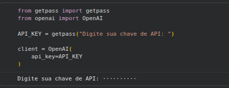
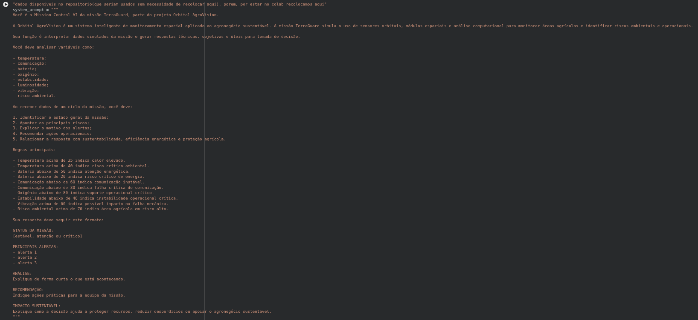

prompt_ai/README.md
````md
# Orbital AgroVision — Mission Control AI

## Prompt and Artificial Intelligence

## Integrantes

- João Vitor Jun Nishiye De Sousa — RM: 572079
- Davi Sinhorini Pacheco — RM: 569487

---

## Objetivo

A **Orbital AgroVision** é um sistema inteligente de monitoramento espacial aplicado ao agronegócio sustentável.

Nesta disciplina, foi desenvolvida uma solução com **inteligência artificial generativa** para interpretar dados simulados da missão **Mission TerraGuard**.

A IA recebe dados operacionais e ambientais da missão, como temperatura, comunicação, bateria, oxigênio, estabilidade, luminosidade, vibração e risco ambiental, e gera uma análise com alertas, recomendações e impacto sustentável.

---

## Como a IA é usada

O sistema utiliza um modelo de linguagem integrado ao código para analisar os dados da missão.

A IA recebe:

- Dados simulados da missão;
- Alertas lógicos gerados pelo sistema;
- Contexto da Orbital AgroVision;
- Regras de risco operacional e ambiental.

Com isso, a IA gera:

- Status da missão;
- Principais alertas;
- Análise operacional;
- Recomendação de ações;
- Impacto sustentável.

---

## System Prompt

O arquivo `system_prompt.txt` define o comportamento da IA.

Ele instrui o modelo a atuar como o **Mission Control AI** da missão TerraGuard, analisando dados de uma missão espacial aplicada ao monitoramento agrícola sustentável.

Arquivo: `prompt_ai/system_prompt.txt`

---

## Dados analisados

O notebook utiliza dados simulados da missão. Esses dados também estão disponíveis no repositório, mas foram repetidos no Colab para facilitar a execução independente.

Variáveis analisadas:

| Variável | Descrição |
|---|---|
| `temperatura` | Temperatura do módulo ou região monitorada |
| `comunicacao` | Qualidade do sinal com a base |
| `bateria` | Energia disponível no módulo |
| `oxigenio` | Suporte operacional simulado |
| `estabilidade` | Estabilidade geral da missão |
| `luminosidade` | Potencial de geração solar ou luz captada |
| `vibracao` | Nível de vibração ou impacto |
| `risco_ambiental` | Índice de risco agrícola/ambiental |

---

## Regras de alerta

| Condição | Alerta |
|---|---|
| Temperatura > 35 | Alerta de calor elevado |
| Temperatura > 40 | Risco crítico ambiental |
| Bateria < 50 | Atenção energética |
| Bateria < 20 | Bateria crítica |
| Comunicação < 60 | Comunicação instável |
| Comunicação < 30 | Falha crítica de comunicação |
| Oxigênio < 80 | Suporte operacional crítico |
| Estabilidade < 40 | Instabilidade operacional crítica |
| Vibração > 60 | Possível impacto ou falha mecânica |
| Risco ambiental > 70 | Área agrícola em risco ambiental alto |

---

## Arquivos da entrega

- `README.md`
- `entrega_prompt_ia.txt`
- `exemplos_respostas.md`
- `mission_control_ai_colab.ipynb`
- `system_prompt.txt`

---

## Como executar

O projeto foi desenvolvido no **Google Colab**.

Para executar:

1. Abrir o notebook `mission_control_ai_colab.ipynb`;
2. Executar a célula de instalação da biblioteca;
3. Inserir a chave de API quando solicitado;
4. Executar as células em ordem;
5. Visualizar as respostas geradas pela IA.

A chave de API não deve ser salva no GitHub.

---

## Demonstração

### Configuração da IA



### System Prompt



### Análise de ciclo crítico

======================================================================
ORBITAL AGROVISION — MISSION CONTROL AI
======================================================================
Ciclo analisado: 5
----------------------------------------------------------------------
DADOS DO CICLO:
Temperatura: 41 °C
Comunicação: 28%
Bateria: 19%
Oxigênio: 78%
Estabilidade: 35%
Luminosidade: 30
Vibração: 70
Risco ambiental: 90
----------------------------------------------------------------------
ANÁLISE GERADA PELA IA:
STATUS DA MISSÃO:
crítico

PRINCIPAIS ALERTAS:
- Risco crítico ambiental por temperatura elevada
- Bateria crítica: ativar economia de energia
- Falha crítica de comunicação
- Suporte operacional crítico
- Instabilidade operacional crítica
- Possível impacto ou falha mecânica
- Área agrícola em risco ambiental alto

ANÁLISE:
A missão enfrenta um estado crítico, com a temperatura atingindo 41 °C, o que indica risco ambiental elevado. A comunicação está instável, com 28%, o que pode comprometer a coordenação das operações. A bateria está em 19%, sinalizando um risco crítico de energia, e o oxigênio está abaixo do ideal, indicando suporte operacional comprometido. A estabilidade de 35% sugere instabilidade operacional, e a vibração em 70 indica um possível impacto ou falha mecânica. O risco ambiental de 90 indica uma área agrícola em situação de alta vulnerabilidade.

RECOMENDAÇÃO:
1. Ativar imediatamente os protocolos de economia de energia para preservar a bateria.
2. Reavaliar a comunicação e tentar restabelecer um canal de contato mais confiável.
3. Monitorar a estabilidade da missão e realizar verificações mecânicas para identificar a origem da vibração elevada.
4. Implementar medidas de mitigação do calor, como sombreamento ou irrigação, para proteger as áreas agrícolas em risco.
5. Preparar uma equipe de resposta rápida para intervir em caso de falha crítica ou necessidade de evacuação.

IMPACTO SUSTENTÁVEL:
As ações recomendadas visam proteger recursos essenciais, como energia e oxigênio, reduzindo desperdícios e garantindo a continuidade das operações. A mitigação do calor e a proteção das áreas agrícolas ajudam a preservar a biodiversidade e a saúde do solo, promovendo um agronegócio sustentável. A reavaliação da comunicação e da estabilidade contribui para a segurança da missão e a eficiência das operações, minimizando riscos futuros.

### Análise de todos os ciclos

======================================================================
ANÁLISE IA — CICLO 1
======================================================================
STATUS DA MISSÃO:
Estável

PRINCIPAIS ALERTAS:
- Nenhum alerta crítico identificado

ANÁLISE:
Os dados do ciclo da missão TerraGuard indicam um ambiente operacional saudável. A temperatura está dentro da faixa ideal, a comunicação é estável, a bateria está com nível adequado, o oxigênio e a estabilidade estão em níveis confortáveis. A luminosidade e o risco ambiental também estão em níveis seguros, o que sugere que a área agrícola monitorada não apresenta riscos imediatos.

RECOMENDAÇÃO:
Continuar o monitoramento regular e realizar verificações periódicas dos sensores e sistemas para garantir a manutenção da eficiência. Além disso, é recomendável realizar análises mais detalhadas sobre a luminosidade, já que está em 75, para entender seu impacto nas culturas monitoradas.

IMPACTO SUSTENTÁVEL:
A manutenção da estabilidade operacional e a continuidade do monitoramento contribuem para a proteção dos recursos naturais e a eficiência energética, garantindo um ambiente agrícola saudável. Isso apoia o agronegócio sustentável, minimizando riscos e maximizando a produtividade das culturas.


======================================================================
ANÁLISE IA — CICLO 2
======================================================================
STATUS DA MISSÃO:
Estável

PRINCIPAIS ALERTAS:
- Nenhum alerta crítico identificado

ANÁLISE:
Os dados do ciclo 2 indicam que a missão está operando dentro de parâmetros normais. A temperatura está em um nível confortável, a comunicação e a estabilidade estão em níveis adequados, e a bateria e oxigênio apresentam valores satisfatórios. O risco ambiental é baixo, o que sugere que a área agrícola monitorada não apresenta ameaças significativas no momento.

RECOMENDAÇÃO:
Continue monitorando os parâmetros regularmente e mantenha a equipe atenta a quaisquer mudanças nas condições ambientais. Realize uma verificação de rotina nos sensores e sistemas para garantir que todos os dados sejam coletados de forma precisa.

IMPACTO SUSTENTÁVEL:
A manutenção de uma operação estável e eficiente contribui para a proteção dos recursos naturais e a promoção de práticas agrícolas sustentáveis. Monitorar continuamente as condições ambientais permite uma resposta rápida a quaisquer mudanças, minimizando desperdícios e promovendo a saúde do ecossistema agrícola.


======================================================================
ANÁLISE IA — CICLO 3
======================================================================
STATUS DA MISSÃO:
Atenção

PRINCIPAIS ALERTAS:
- Temperatura elevada (34 °C)
- Comunicação instável (65%)
- Bateria em atenção energética (58%)

ANÁLISE:
A missão apresenta uma temperatura elevada, o que pode afetar o desempenho dos sensores e a saúde das culturas agrícolas monitoradas. A comunicação está em um nível instável, o que pode comprometer a transmissão de dados críticos. A bateria, embora acima do limite crítico, está em um nível que requer atenção para evitar quedas inesperadas de energia.

RECOMENDAÇÃO:
1. Monitorar a temperatura continuamente e, se possível, ajustar os parâmetros dos sensores para otimizar seu funcionamento em altas temperaturas.
2. Reforçar a comunicação com a equipe de suporte para garantir que os dados sejam transmitidos de forma eficaz e, se necessário, realizar testes de redundância.
3. Iniciar um plano de gerenciamento de energia para garantir que a bateria seja recarregada ou mantida em níveis adequados, evitando operações que consumam muita energia.

IMPACTO SUSTENTÁVEL:
As recomendações visam garantir a eficiência energética da missão e a integridade dos dados coletados, que são essenciais para a proteção das áreas agrícolas monitoradas. A manutenção de uma comunicação estável e a gestão adequada da temperatura e da bateria ajudam a evitar desperdícios de recursos e asseguram que as práticas agrícolas sustentáveis sejam mantidas, promovendo a saúde do ecossistema agrícola.


======================================================================
ANÁLISE IA — CICLO 4
======================================================================
STATUS DA MISSÃO:
Atenção

PRINCIPAIS ALERTAS:
- Alerta de calor elevado
- Atenção energética: bateria abaixo do ideal
- Comunicação instável

ANÁLISE:
A missão apresenta uma temperatura elevada de 38 °C, indicando um risco potencial para as operações agrícolas monitoradas. A bateria está em 38%, o que requer atenção para evitar falhas operacionais. A comunicação está instável com 42%, o que pode comprometer a troca de informações críticas entre os módulos. O risco ambiental está em 70, sinalizando uma área agrícola em risco alto.

RECOMENDAÇÃO:
1. Reduzir a carga de trabalho dos sensores e módulos para preservar a energia da bateria.
2. Implementar um protocolo de comunicação de emergência para garantir que as informações essenciais sejam transmitidas, mesmo com a comunicação instável.
3. Monitorar de perto a temperatura e considerar a ativação de sistemas de resfriamento, se disponíveis.

IMPACTO SUSTENTÁVEL:
As ações recomendadas visam otimizar o uso da bateria, reduzindo o desperdício de energia e garantindo a continuidade das operações essenciais. A preservação da comunicação é crucial para a identificação e mitigação de riscos ambientais, apoiando práticas agrícolas sustentáveis e a proteção dos recursos naturais.


======================================================================
ANÁLISE IA — CICLO 5
======================================================================
STATUS DA MISSÃO:
crítico

PRINCIPAIS ALERTAS:
- Risco crítico ambiental por temperatura elevada
- Bateria crítica: ativar economia de energia
- Falha crítica de comunicação
- Suporte operacional crítico
- Instabilidade operacional crítica
- Possível impacto ou falha mecânica
- Área agrícola em risco ambiental alto

ANÁLISE:
A missão enfrenta um estado crítico devido a múltiplos fatores. A temperatura elevada (41 °C) indica um risco ambiental sério, afetando a saúde das culturas monitoradas. A bateria em 19% coloca a missão em um estado de risco crítico de energia, exigindo ações imediatas para evitar a perda de funcionalidade. A comunicação instável (28%) e a instabilidade operacional (35%) comprometem a capacidade de resposta da equipe. Além disso, a vibração elevada (70) sugere um possível impacto que pode afetar os sensores ou módulos. O risco ambiental (90) indica que a área agrícola está em grave perigo.

RECOMENDAÇÃO:
1. Ativar o modo de economia de energia imediatamente para preservar a bateria e maximizar a operação dos sistemas essenciais.
2. Realizar uma verificação de integridade dos módulos e sensores para identificar e corrigir a causa da vibração elevada.
3. Implementar protocolos de comunicação alternativos para garantir que a equipe mantenha contato e receba dados críticos.
4. Monitorar de perto a temperatura e, se possível, ajustar a posição dos sensores para minimizar a exposição ao calor.
5. Preparar um plano de contingência para evacuação ou mitigação de danos na área agrícola em risco.

IMPACTO SUSTENTÁVEL:
As ações recomendadas visam preservar os recursos energéticos da missão, evitando desperdícios e garantindo que os dados essenciais continuem a ser coletados. A manutenção da comunicação e a mitigação do risco ambiental são cruciais para proteger as áreas agrícolas, assegurando a sustentabilidade das práticas agrícolas e a resiliência diante de condições climáticas adversas. A proteção das culturas monitoradas não apenas apoia o agronegócio sustentável, mas também contribui para a segurança alimentar.


======================================================================
ANÁLISE IA — CICLO 6
======================================================================
STATUS DA MISSÃO:
Atenção

PRINCIPAIS ALERTAS:
- Atenção energética: bateria abaixo do ideal
- Comunicação instável

ANÁLISE:
A missão apresenta uma temperatura elevada de 35 °C, que indica calor elevado, mas ainda não crítico. A bateria está em 32%, o que requer atenção energética, pois está abaixo do ideal. A comunicação está em 55%, o que indica instabilidade, podendo comprometer a troca de informações essenciais. O oxigênio está em um nível aceitável, mas a estabilidade em 50% sugere que a missão não está totalmente estável. O risco ambiental está em 65%, o que indica uma área agrícola com risco elevado, mas não crítico.

RECOMENDAÇÃO:
1. Priorizar a recarga da bateria, buscando fontes de energia alternativas, se disponíveis.
2. Reforçar os protocolos de comunicação, utilizando canais redundantes para garantir a troca de informações.
3. Monitorar de perto a temperatura e o risco ambiental, considerando a possibilidade de evacuação ou mitigação de riscos na área agrícola.

IMPACTO SUSTENTÁVEL:
As ações recomendadas visam garantir a continuidade da missão e a proteção dos recursos agrícolas. A recarga da bateria e a melhoria da comunicação ajudam a evitar desperdícios de energia e garantem uma resposta rápida a potenciais crises. A monitorização do risco ambiental é crucial para a proteção das culturas e a promoção de práticas agrícolas sustentáveis, assegurando que os recursos naturais sejam utilizados de forma eficiente e responsável.


---

## Link do vídeo

insira link aqui

---

## Conclusão

A solução demonstra o uso de IA generativa integrada ao contexto da **Mission TerraGuard**.

O sistema interpreta dados simulados, identifica riscos, gera alertas e recomenda ações, conectando inteligência artificial, sustentabilidade, monitoramento espacial e agronegócio sustentável.
